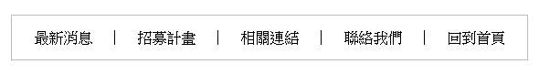
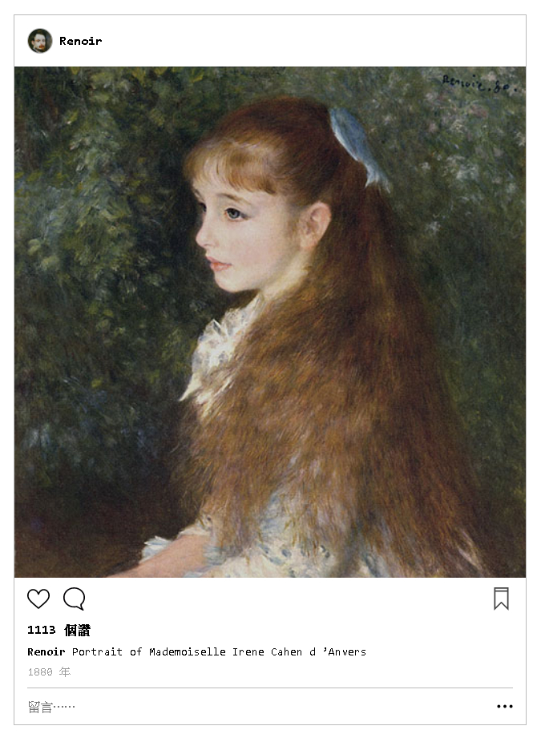
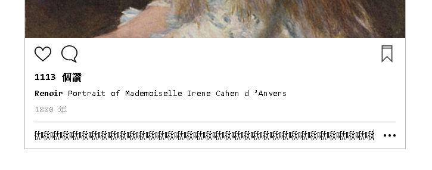
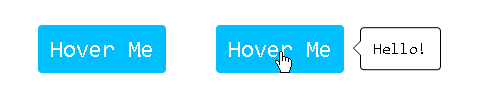
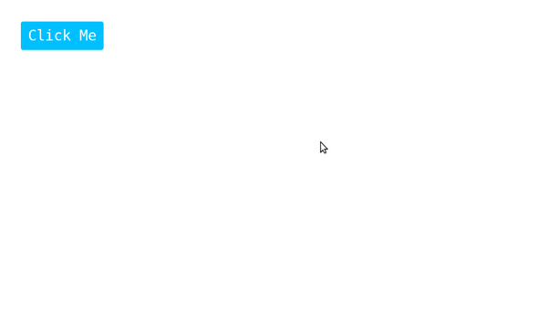
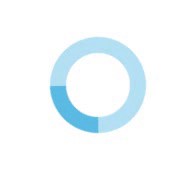

# 2017 Webpage Design Midterm

## Rules

+ 不准與他人交談、通訊，無論藉由手機、通訊軟體、協作筆記，一經發現一律零分。
+ 為了作答允許使用任何工具： Google 、 Sass 、任何編輯器。
+ 所有題目需求僅需在 Chrome 61 正常顯示即可。
+ 全題目配分為 160% ，超過 100% 算 100%。

## Question 1 `20%`

垂直置中 `#red_ball`  
無論 `#container` 大小

## Question 2 `20%`

將 `#menu` 格式化與圖片相符  
**修改 html 是不被允許的**

內距 上下為 `1em` ，左右為 `1.5em`  
間格線 寬度為 `1px` ，高度為 `1em` ，顏色為 `black`  
外框線 寬度為 `1px` ， 顏色為 `#bbb`

## Question 3 `40%`

### 帳號部份 `8%`

### 照片部份 `8%`

### 按鈕區域 `8%`

### 讚數、文章內容 `8%`

### 留言框 `8%`

+ 整體
  + 字體大小 為 `14px` ，字型 為 `"Roboto Mono", monospace`
  + 寬度為 `40em`
  + 具有 `1px` 的 `#bbb` 的框線
+ 帳號
  + 內距 為 `1em`
  + 圖片
    + 來源 `avatar.jpg`
    + 大小 為 `2em` ， `圓形` ，具有 `1px` 的 `#bbb` 框線
  + 文字內容 為 `Renoir` ， `粗體`
  + 整體布局垂直置中，圖片與文字間距 `0.5em`
+ 照片
  + 來源 `paint.jpg`
  + 與邊邊貼齊，沒有空隙
+ 內容
  + 內距 為上下 `0.8em` ，左右 `1em`
  + 內部元素彼此間距 `0.8rem`
  + 按鈕
    + 來源 `like.svg`、`comment.svg`、`collect.svg`
    + 按鈕大小 為 `1.8em`
    + like 與 commit `靠左` ，彼此間距為 `1em`
    + collect `靠右`
  + 讚數
    + 內容 為 `1113 個讚` ， `粗體`
  + 留言
    + 字體大小 為 `0.9em`
    + 帳號內容 為 `Renoir` ， `粗體`
    + 留言內容 為 `Portrait of Mademoiselle Irene Cahen d ’Anvers`
    + 帳號與留言間距 `0.5rem`
  + 年份
    + 字體大小 為 `0.9em` ，內容為 `1880 年`
  + 留言
    + 
    + 寬度 為 `1px`，`#bbb` 的上框線，下面距離 `0.8em`
    + 輸入框
      + 寬度 `填滿剩餘空間`
    + 選單
      + 大小為 `1.2em`
      + 與左側輸入框距離 `1em`

## Question 4 `30%`

### Hover 反應 `10%`
### 氣泡框 `10%`
### 三角形 `10%`

當滑鼠移置 Hover Me  
右邊會顯示 `Hello!` 的氣泡框 (popover)  
邊邊有個三角形

## Question 5 `30%`

### 對話框 `10%`

### 背景 `10%`

### 按鈕反應 `10%`

點擊 `Click Me`  
會啟動一個對話框  
點選背景或藍字會關閉對話框  

+ 背景
  + 顏色為 `rgba(0,0,0,0.5)`

+ 對話框
  + 寬度為 `30rem` 、圓角 `4px` 、內距 `1em`
  + 間格線為 `1px` 、 `實心` 、 `#bbb`
  + `垂直置中`
  + `當畫面捲動時位置不變`
  + 文字顏色為 `deepskyblue`

## Question 6 `20%`

深藍 為 `#5bbce4`  
淺藍 為 `#b3e0f2`  
圓寬 為 `6em`  
甜甜圈厚度 為 `1em`  
轉一圈的時間 為 `800ms`
